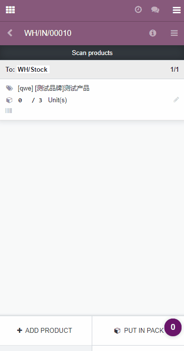

# Barcode Backgroud

**Base on Enterprise Module stock_barcode**

扫码改变背景颜色，基于odoo企业版(v12) stock_barcode模块。

## usage

When scan quantity not equals the required quantity, the background color of the line is progressing blue.
when scan quantity equals the required quantity, the background will be green.
otherwise yellow.

当扫码数量小于需求数量时，背景色为渐变蓝色。
当扫码数量等于需求数量时，背景色为绿色。
当扫描产品不在需求列表或者数量超过需求数量时，背景色为黄色。

